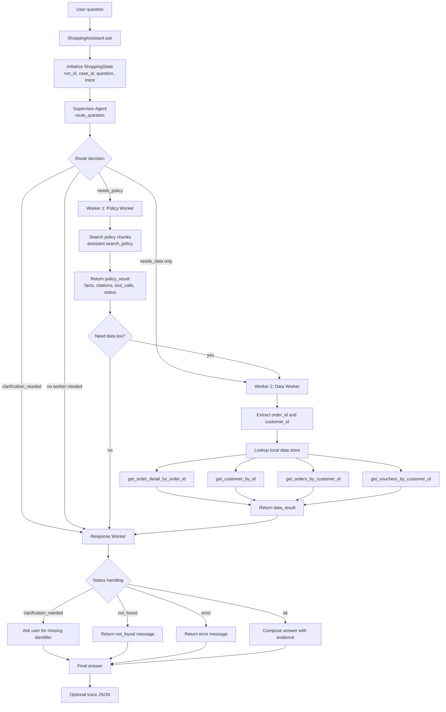

# Supervisor-Worker Agent Report

## Overview

This project implements a shopping assistant using a Supervisor-Worker multi-agent architecture. The graph is built with LangGraph in `src/app/graph.py` and uses a shared `ShoppingState` object from `src/app/state.py` to pass routing decisions, worker outputs, final answers, and trace events between nodes.

The assistant handles three main question types:

- Policy questions, such as return windows, refund rules, delivery policy, and voucher policy.
- Data lookup questions, such as customer, order, and voucher status.
- Mixed questions that require both policy evidence and order/customer facts.

## Flowchart



## Agent Responsibilities

### Supervisor Agent

The supervisor is implemented by `supervisor_node` and `route_question`. It inspects the user question, extracts identifiers, and decides whether the run needs policy retrieval, local data lookup, both, or clarification.

Main outputs:

- `status`: `ok` or `clarification_needed`
- `needs_policy`: whether policy evidence is required
- `needs_data`: whether local customer/order/voucher data is required
- `policy_task`: task description for the policy worker
- `data_task`: task description for the data worker
- `reason`: human-readable routing explanation

### Worker 1: Policy Worker

The policy worker retrieves relevant policy chunks through `assistant.search_policy`. It returns a structured `policy_result` with:

- `summary`: compact policy summary
- `facts`: extracted policy facts
- `citations`: policy chunk citations
- `tool_calls`: retrieval metadata
- `status`: `ok`, `not_found`, or `error`

Policy chunks are parsed from the Markdown knowledge base using an H2 + H3 + content structure in `src/rag/parser.py`.

### Worker 2: Data Worker

The data worker extracts order IDs and customer IDs from the question, then queries the local `ShoppingDataStore` in `src/app/data_access.py`.

Available lookup functions:

- `get_order_detail_by_order_id`
- `get_customer_by_id`
- `get_orders_by_customer_id`
- `get_vouchers_by_customer_id`

It returns `data_result` with facts, tool call history, lookup status, warnings, and errors. If the question asks for personal data but does not include an order ID or customer ID, the system returns `clarification_needed` instead of guessing.

### Worker 3: Response Worker

The response worker synthesizes the final answer. It handles failure states first, then builds an evidence-backed answer from policy and data results.

Response priority:

1. Ask a clarification question when required identifiers are missing.
2. Return `not_found` when a requested customer, order, voucher, or policy cannot be found.
3. Return `error` when both policy and data workers fail.
4. Return an answer with policy evidence, order/customer facts, and citations.

## State and Observability

The graph shares state through `ShoppingState`, which includes:

- `question`
- `route`
- `policy_result`
- `data_result`
- `final_answer`
- `trace`

Each node emits a trace event through `make_trace_event` in `src/app/tracing.py`. Trace records include node name, event name, status, input payload, output payload, warnings, errors, and latency in milliseconds. The CLI can write these traces to JSON with `--trace-file`, and batch runs write per-case traces under the configured traces directory.

## Execution Paths

Policy-only path:

```text
User -> Supervisor -> Policy Worker -> Response Worker -> Final answer
```

Data-only path:

```text
User -> Supervisor -> Data Worker -> Response Worker -> Final answer
```

Mixed policy + data path:

```text
User -> Supervisor -> Policy Worker -> Data Worker -> Response Worker -> Final answer
```

Clarification path:

```text
User -> Supervisor -> Response Worker -> Clarification question
```

## Batch Evaluation

`ShoppingAssistant.run_batch` runs all cases in `data/test.json`, writes trace files, and computes:

- route accuracy
- status accuracy
- expected-content accuracy

The optional recommendation step analyzes failed cases and emits improvement suggestions for routing, status handling, worker reliability, and response evidence.

## Design Notes

The architecture keeps routing, retrieval, lookup, and response synthesis separated. This makes each worker easier to debug and lets the trace show exactly where a result came from. The supervisor controls orchestration, while workers stay focused on one responsibility: policy retrieval, structured data lookup, or final answer synthesis.
